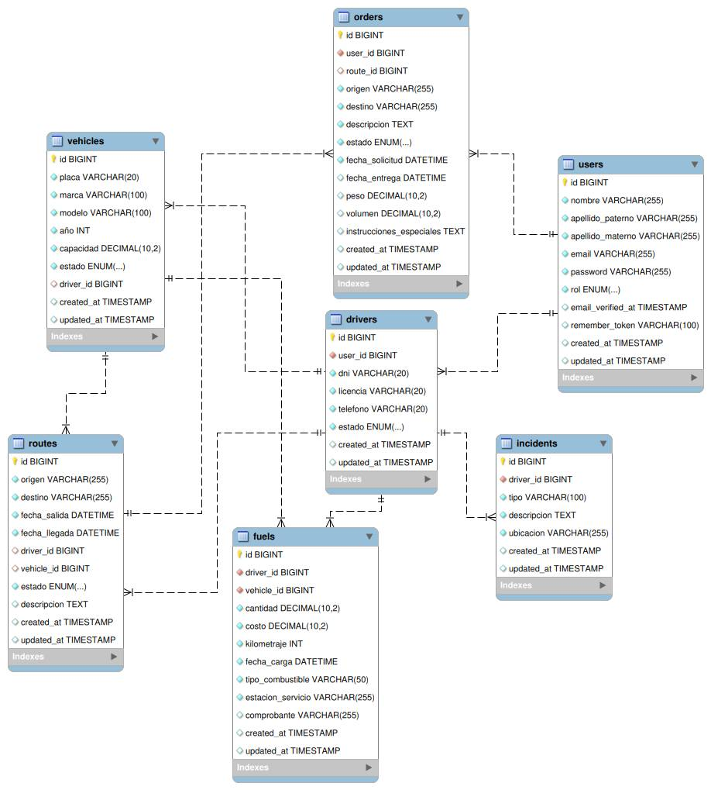

# Sistema de Gestión de Transporte
Repositorio para el proyecto final del curso Taller De Programación Web.

## Curso
 Taller De Programación Web

## Docente
 [Diego Fernando Baes Vasquez](https://github.com/diegobaesv)

## Tema
 Sistema de Gestión de Transporte

## Tecnologías Utilizadas
- **Backend**
  - PHP
  - Laravel
  - Composer (Gestor de dependencias PHP)

- **Frontend**
  - Tailwind CSS
  - JavaScript
  - NPM (Gestor de paquetes Node.js)

- **Base de Datos**
  - MySQL/MariaDB

- **Herramientas de Desarrollo**
  - Git (Control de versiones)

## Requisitos del Sistema
- PHP >= 8.4.5
- Laravel >= 12.2.0
- Composer >= 2.8.6
- Node.js >= 23.9.0
- NPM >= 11.2.0
- MySQL >= 8.0.23 o MariaDB >= 11.7.2
- Extensión PHP para MySQL, OpenSSL, PDO, Mbstring, Tokenizer, XML, Ctype & JSON

## Instalación
1. Clonar el repositorio:
   ```bash
   git clone https://github.com/2017310708/sistema-gestion-transporte.git
   cd sistema-gestion-transporte
   ```

2. Instalar dependencias PHP:
   ```bash
   composer install
   ```

3. Instalar dependencias JavaScript:
   ```bash
   npm install
   ```

4. Configurar el archivo `.env`:
   - Copiar el archivo `.env.example` a `.env`
   - Configurar las variables de entorno:
     - `DB_CONNECTION=mysql`
     - `DB_HOST=127.0.0.1`
     - `DB_PORT=3306`
     - `DB_DATABASE=nombre_base_datos`
     - `DB_USERNAME=usuario`
     - `DB_PASSWORD=contraseña`

5. Generar clave de aplicación:
   ```bash
   php artisan key:generate
   ```

6. Ejecutar migraciones y seeders:
   ```bash
   php artisan migrate --seed
   ```

7. Compilar assets:
   ```bash
   npm run build
   ```

8. Iniciar el servidor de desarrollo:
   ```bash
   php artisan serve
   ```

## Alcance del Proyecto
El sistema de gestión de transporte es una aplicación web diseñada para optimizar y automatizar las operaciones de empresas de transporte. El sistema aborda las siguientes áreas clave:

### Módulos Principales
- **Gestión de vehículos**
  - Registro y actualización de información de vehículos (placa, marca, modelo, año, capacidad)
  - Control de estado de vehículos (activo, mantenimiento, inactivo)
  - Asignación de conductores a vehículos

- **Gestión de rutas**
  - Creación y modificación de rutas con origen y destino
  - Programación de fechas de salida y llegada
  - Asignación de conductores y vehículos a rutas
  - Seguimiento de estado de rutas (programada, en curso, completada, cancelada)

- **Gestión de conductores**
  - Registro de conductores con datos personales (DNI, licencia, teléfono)
  - Control de estado de conductores (disponible, en ruta, descanso)
  - Registro de incidentes durante el servicio
  - Control de recargas de combustible

- **Gestión de pedidos**
  - Registro de pedidos de clientes con detalles de carga
  - Seguimiento del estado de pedidos (pendiente, asignado, en ruta, entregado, cancelado)
  - Asignación de pedidos a rutas
  - Historial de pedidos por cliente

- **Panel de control**
  - Dashboard personalizado por rol (admin, conductor, cliente)
  - Estadísticas de vehículos, conductores y rutas
  - Seguimiento de pedidos activos y completados
  - Monitoreo de estado de flota

### Características Técnicas
- Interfaz web responsive
- Base de datos relacional

## Seguridad
- **Control de Acceso Basado en Roles (RBAC)**
  - Administrador: Acceso completo al sistema
  - Conductor: Gestión de rutas asignadas, reporte de incidentes y control de combustible
  - Cliente: Gestión de pedidos y seguimiento de envíos

- **Autenticación y Autorización**
  - Sistema de login seguro con hash de contraseñas
  - Middleware de verificación de roles
  - Protección contra ataques CSRF
  - Validación de datos en formularios
  - Sanitización de inputs

- **Protección de Datos**
  - Encriptación de datos sensibles
  - Logs de actividad del sistema

## Integrantes
 - [Jose Carlos Yon](https://github.com/2017310708)

## Diseño de la BD

